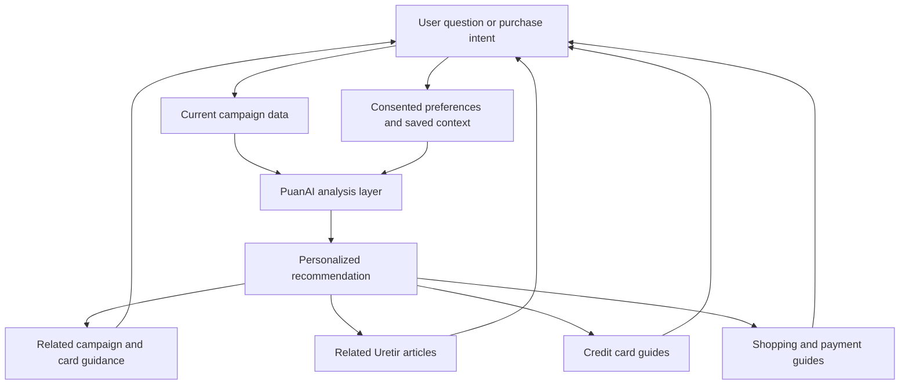

# PuanAI Product Loop

## Purpose

PuanAI is Uretir's shopping-intelligence product. It helps a user make a better purchase decision by connecting current campaign data, transparent analysis, personal preferences, and durable Uretir guidance.

The goal is not to show a campaign list. The goal is to become a daily assistant that answers: which card, payment method, marketplace, or installment option is most useful for this purchase right now?

## Core flow



## Input contract

### User intent

PuanAI accepts explicit intent such as purchase category, merchant, estimated spend, desired installment count, card ownership, reward preference, and time sensitivity. Do not infer sensitive financial details from unrelated behavior.

### Campaign data

The current implementation uses structured sample data. It is a product prototype, not a live financial-data service. Before a campaign is described as current or recommended for a real transaction, its data must include provider source, retrieval time, publication time when available, expiry, eligibility rules, card scope, merchant scope, and sync status.

### Personal context

Personalization uses only explicit or consented signals: saved cards, preferred reward type, saved merchants/categories, followed shopping guides, and notification preferences. Users can inspect, edit, or disable these signals. PuanAI must work meaningfully without an account.

## Analysis layer

The analysis layer ranks eligible options; it does not present an unexplained answer. Each recommendation must expose:

- The best option and the reason it was selected.
- Assumptions such as spend, merchant, card ownership, and payment method.
- Campaign eligibility and expiry.
- Source and freshness status.
- Alternatives with meaningful trade-offs.
- Uncertainty or missing information that may change the result.

Never imply that a campaign is valid, a marketplace is cheapest, or a card is best without adequate current data. PuanAI is decision support, not financial advice.

## Discovery outputs

Every useful recommendation offers relevant next paths, chosen for the user's actual task:

- Related Uretir articles for the purchase or decision context.
- Credit card guides explaining fees, reward programs, installment rules, and eligibility.
- Shopping guides covering merchants, timing, payment methods, and price-comparison literacy.
- Related campaigns, cards, banks, and merchant pages.

Links must be contextual. Do not add unrelated article modules merely to increase sessions.

## Data architecture

```text
Sample / provider campaign adapter
  -> normalized campaign record
  -> eligibility and freshness checks
  -> recommendation analysis
  -> explanation and alternatives
  -> Uretir knowledge-graph links
  -> user feedback, save, or notification preference
```

The normalized record must remain independent of any one bank, marketplace, affiliate provider, or future data vendor. Provider adapters own ingestion; PuanAI owns canonical IDs, normalized terms, freshness, eligibility interpretation, and user-facing explanation.

## Quality and safety

- Display sample-data status clearly until live integrations are verified.
- Link to original campaign terms when available.
- Do not hide exclusions, caps, participation requirements, or expiry dates.
- Do not collect payment credentials, bank passwords, or transaction history.
- Never rank an option higher because of an undisclosed commercial relationship.
- Keep public campaign and guide pages fast, accessible, and crawlable.

## Success signals

Measure task completion, source click-through, recommendation correction rate, saved campaigns, return usage, notification usefulness, relevant guide discovery, and user trust feedback. Do not use raw clicks as the only indicator of value.
