# Uretir.com Release Candidate Product Review

Review date: 25 July 2026  
Reviewed revision: `cf50e747cf7ccd9bb5f4a4279d34e12a56067b09` plus one uncommitted runtime-blocker fix documented below  
Scope: current implementation only; no redesign and no new feature work

## Executive summary

Uretir already looks like a thoughtful, distinctive product and its repository contains an unusually mature set of editorial, trust, SEO, knowledge-graph, and operating principles. The strongest work is the design language, publication safety, static performance profile, explicit trust states, and the breadth of the documented product model.

It is not yet a production-quality knowledge platform. The public production corpus contains no authority-ready article, company, guide, or person profile. Most AI products are transparent foundations rather than functioning AI services. There is no CMS, database, authentication, persistent workspace, live source ingestion, analytics provider, observability, or operated deployment/rollback path. The product currently demonstrates a credible system design more than a complete user outcome.

The most important finding is therefore not “build more pages.” It is: complete one verified, human-reviewed topic cluster and one source-grounded user loop, instrument it, and prove that users can discover, trust, continue, and return.

## Verification record

- `pnpm quality`: passed after the blocking fix.
- ESLint: passed.
- TypeScript: passed through the production build.
- Production dependency audit: no known vulnerabilities.
- Next.js production build: passed; 31 static generation tasks.
- Search validation: 464 checks passed across 21 generated HTML files.
- Sitemap: 7 approved URLs.
- Inspected noindex pages: 14.
- RSS items: 0 by design because no article passes the publication gate.
- Browser inventory: 52 screens, 104 screenshots.
- Browser structural audit: 0 navigation failures, 0 horizontal-overflow failures, 0 missing H1s, 0 missing `main` landmarks, and 0 images without `alt`.
- Production smoke test: public routes returned 200; an unpublished article returned a hard 404.

One real runtime blocker was found in local editorial preview. `ContentDiscoverySection` sent Turkish display labels such as “Mimarlık” and “İleri okuma” into an analytics target contract that accepts machine-safe identifiers only. The smallest safe correction changes the target to stable positional identifiers such as `item-1`. No UI or feature behavior was added.

During the audit, seven stale local Next.js processes were also found concurrently writing to `.next`, which produced corrupted test artifacts and false 500 responses. Those processes were stopped and the application was rebuilt in isolation. This was a review-environment collision, not a repository defect.

## How to read the walkthrough

“Production” means directly available from the optimized production server. “Noindex” means available to users with an explicit crawl exclusion. “Editorial preview only” means visible in local development for review but intentionally absent from production, public search, sitemap, RSS, and recommendations.

Every screenshot is a viewport capture from the top of the route after entrance animation settled. Desktop is 1440×900; mobile is 390×844.

## Shared layout, navigation, and global components

- Header: logo, primary navigation, global search, theme control, and responsive mobile menu. Uretir ID is shown only in local editorial preview.
- Main shell: skip link, one root `main`, route content, global JSON-LD, and provider-neutral analytics event bridge.
- Footer: editorial positioning, RSS-based newsletter alternative, contact route, product and company links.
- Existing: responsive navigation, light/dark mode, keyboard focus styling, skip navigation, canonical metadata, global Organization/WebSite schema.
- Missing: authenticated navigation, notification state, production analytics adapter, consent management, locale switcher, and a live newsletter provider.
- UX: strong consistency and distinctive typography; several large hero treatments defer the first concrete user outcome below the fold on mobile.
- SEO: global metadata is solid, but public authority depth is too small for the navigation system to generate meaningful topical discovery.
- Accessibility: semantic landmarks, reduced-motion handling, focus states, and 44px controls are present. Automated color-contrast and full keyboard regression testing are not part of the repository gate.
- Performance: no third-party runtime scripts or heavy image inventory; the shared first-load JavaScript is 102 kB.
- Technical: Server Components are the default, with narrow client islands for search/filtering, theme, PuanAI, and Uretir ID.

## Production-accessible screens

### 1. Ana Sayfa — `/`

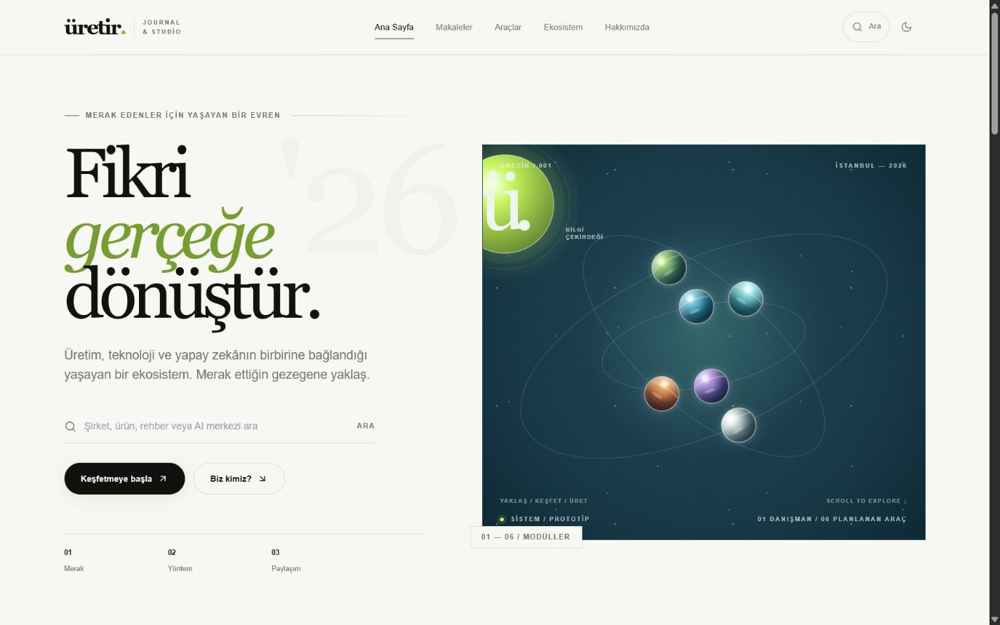 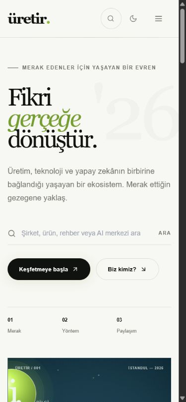

- Purpose: introduce Uretir as a production-knowledge ecosystem and route users into search, discovery, and AI tools.
- Main components: global header, editorial hero, inline search, animated ecosystem universe, content/product sections, footer.
- Existing functionality: working search submission, product navigation, interactive universe controls, responsive menu, theme switch, RSS route.
- Missing functionality: public reference content and personalized return paths; the “living universe” is primarily presentational today.
- UX observations: visually memorable and premium; the core promise is clear, but the right-side visual dominates desktop and falls below the first decision content on mobile.
- SEO observations: indexable canonical homepage with Organization and WebSite schema; the page lacks a deep public content corpus to substantiate the authority promise.
- Accessibility observations: single H1, main landmark, skip link, labelled controls, no overflow. Motion reduction is implemented.
- Performance/technical observations: static route, 109 kB first load, no raster-image payload; animation and the interactive hero are the principal client-side cost.

### 2. Evrensel Arama — `/ara?q=tesvik`

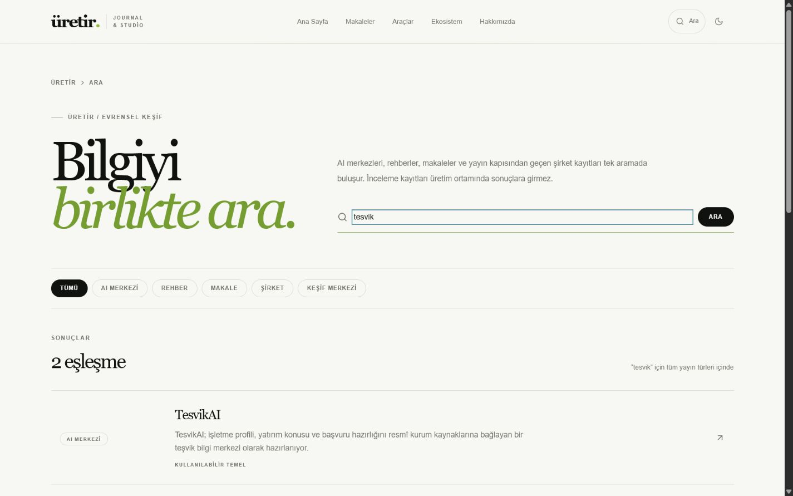 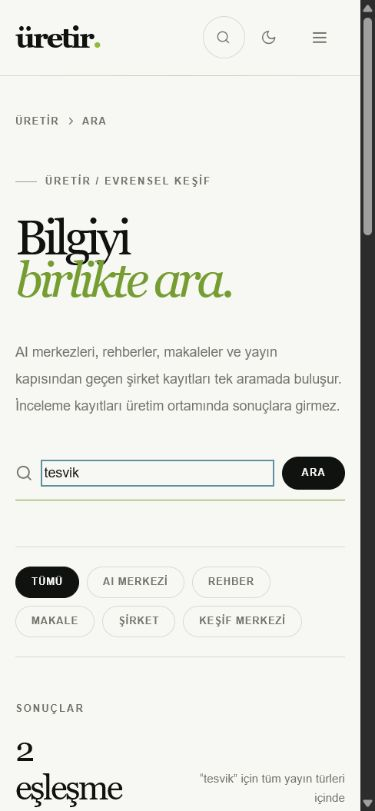

- Purpose: search public hubs and publication-approved records from one surface.
- Main components: query form, type filters, result count, trust labels, result links.
- Existing functionality: server-rendered query handling, Turkish-normalized in-memory search, publication filtering, no query persistence.
- Missing functionality: external search engine, typo tolerance, ranking telemetry, suggestions, saved searches, and sufficient public records.
- UX observations: transparent empty/result states and clear trust language; utility is constrained by the tiny production index.
- SEO observations: correctly `noindex, follow` with a canonical route; search results do not leak drafts.
- Accessibility observations: labelled input, one H1/main, keyboard-native form and links, no overflow.
- Performance/technical observations: dynamic server route, 106 kB first load; search is a file-backed projection rather than an operated index.

### 3. Araçlar — `/araclar`

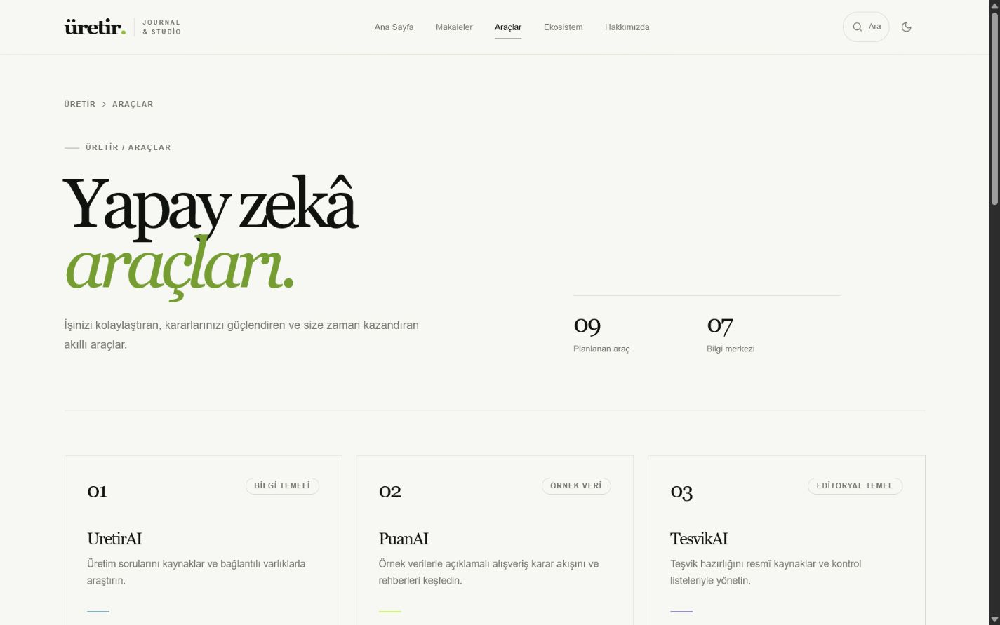 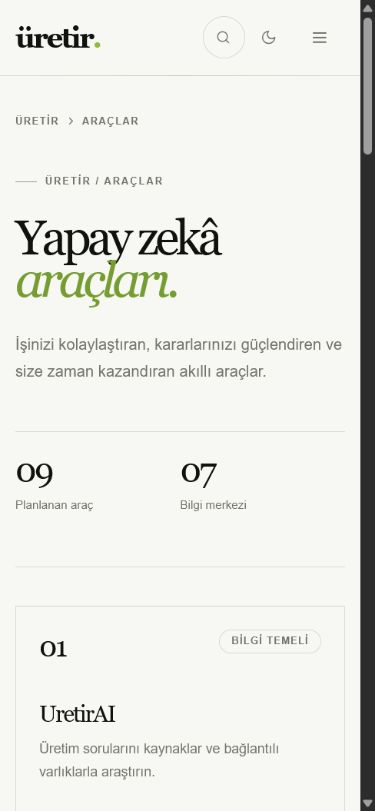

- Purpose: directory for current and planned AI/product hubs.
- Main components: hero, status-labelled tool cards, ecosystem links, contribution CTA.
- Existing functionality: navigates to each implemented foundation and communicates product availability.
- Missing functionality: most cards do not lead to completed task outcomes; no comparison, recent activity, or personalized tool order.
- UX observations: clean product map with strong scanability; “tool” framing can overpromise where the destination is still educational.
- SEO observations: indexable canonical hub; internal links are useful, but topical content beneath the hub is not yet public.
- Accessibility observations: semantic links, visible focus, one H1/main, responsive card grid.
- Performance/technical observations: static Server Component, 106 kB first load, no external data dependency.

### 4. Blog — `/blog`

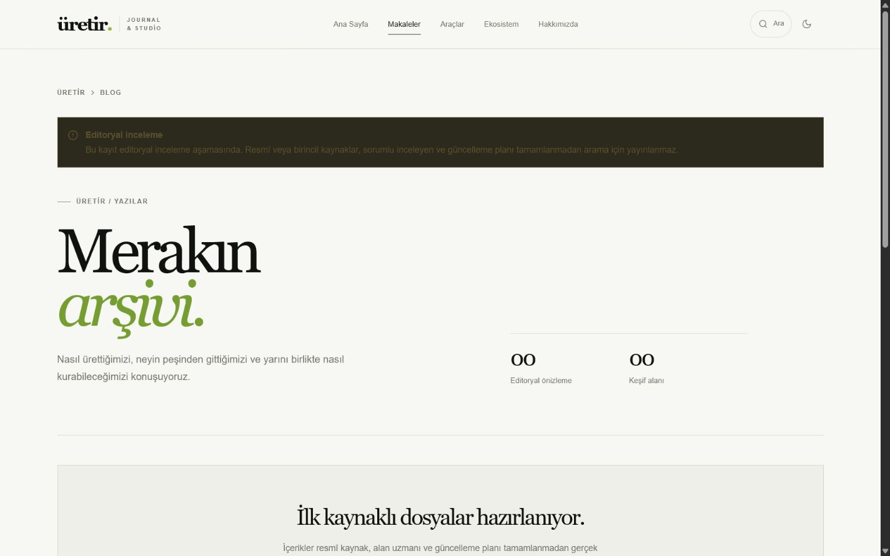 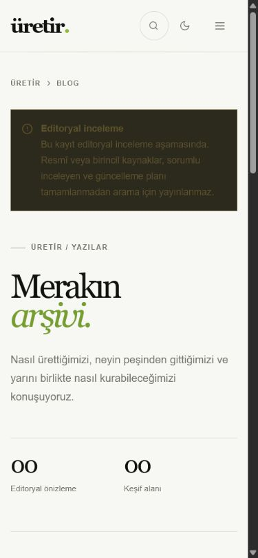

- Purpose: publication archive for approved editorial content.
- Main components: review notice, archive hero, publication counters, production empty state; local preview additionally has search/filter cards.
- Existing functionality: publication-aware rendering and explicit refusal to expose review content in production.
- Missing functionality: every article is still in review, so production contains no archive value.
- UX observations: the honest empty state preserves trust but confirms that the core content product has not launched.
- SEO observations: correctly noindexed and omitted from sitemap while no approved article exists.
- Accessibility observations: one H1/main, clear status copy, no overflow.
- Performance/technical observations: dynamic because of search parameters; 110 kB first load. File-backed review records are gated by `isIndexableReference`.

### 5. Ekosistem — `/ekosistem`

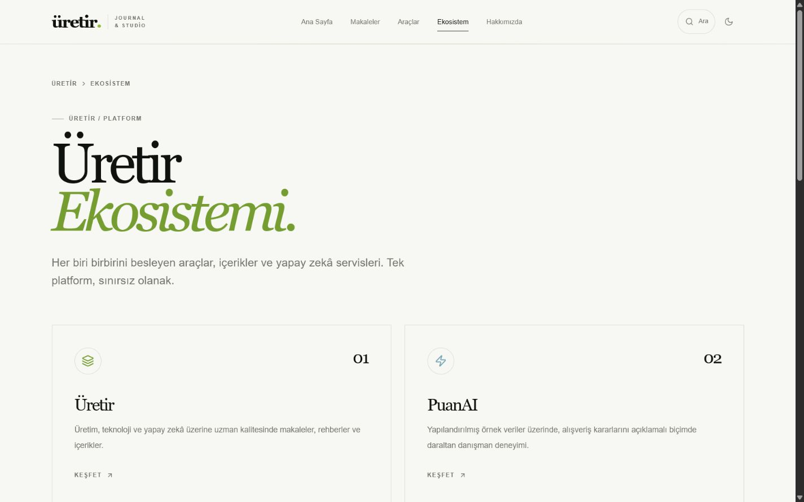 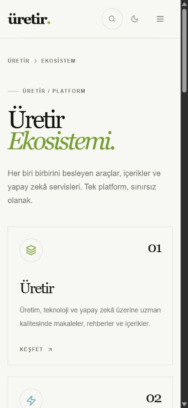

- Purpose: explain how Uretir’s products and knowledge surfaces connect.
- Main components: vision hero, product relationship cards, discovery links.
- Existing functionality: navigable portfolio overview with consistent availability language.
- Missing functionality: cross-product context handoff, shared identity, saved workspace, and measurable user loops.
- UX observations: creates confidence in the ambition but is roadmap-heavy relative to immediately usable outcomes.
- SEO observations: indexable canonical ecosystem page; functions more as product positioning than a search-intent destination.
- Accessibility observations: semantic headings/links, one H1/main, responsive layout.
- Performance/technical observations: static and lightweight at 106 kB first load.

### 6. FiyatAI — `/fiyat-ai`

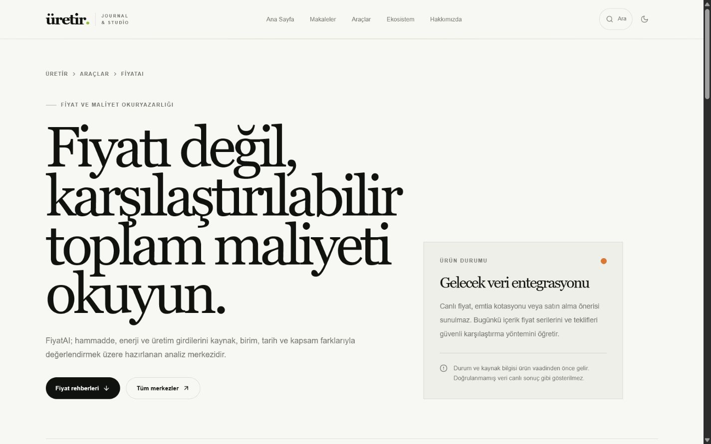 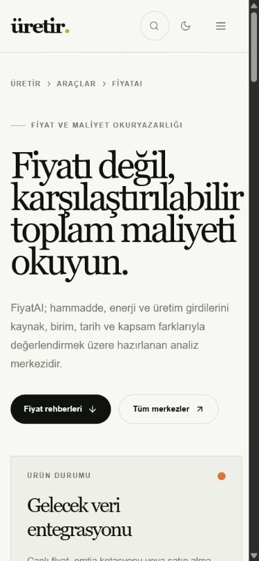

- Purpose: teach trustworthy price and total-cost comparison methodology.
- Main components: hub hero, capability cards, workflow, FAQ, guide section, related hubs.
- Existing functionality: explains units, provenance, time, and purchasing context.
- Missing functionality: live price feeds, normalization, historical charts, calculators, alerts, and verified records.
- UX observations: credible educational framing; it does not yet complete a price decision.
- SEO observations: noindex foundation; guide links disappear in production until publication approval.
- Accessibility observations: strong heading structure, FAQ disclosures, one H1/main, no overflow.
- Performance/technical observations: static 106 kB route; domain capability is modelled but no adapter is connected.

### 7. Gizlilik Politikası — `/gizlilik-politikasi`

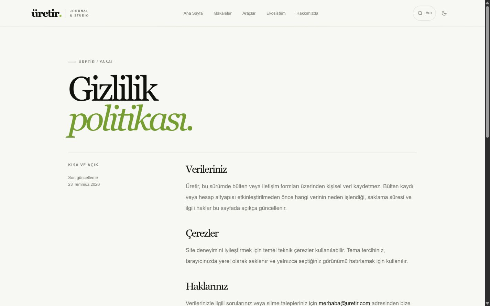 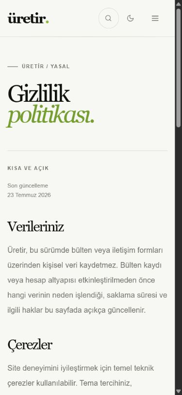

- Purpose: disclose current data handling.
- Main components: policy hero and scoped policy sections.
- Existing functionality: accurately states the current non-persistent measurement and data-collection posture.
- Missing functionality: controller identity, retention, rights, cookie details, and processor list will need expansion before real accounts, analytics, or subscriptions.
- UX observations: readable and plain-language, though legal completeness depends on future integrations.
- SEO observations: indexable canonical legal page and included in sitemap.
- Accessibility observations: semantic text hierarchy, one H1/main, no overflow.
- Performance/technical observations: static 103 kB first load; no consent SDK or data controller backend exists.

### 8. Hakkımızda — `/hakkimizda`

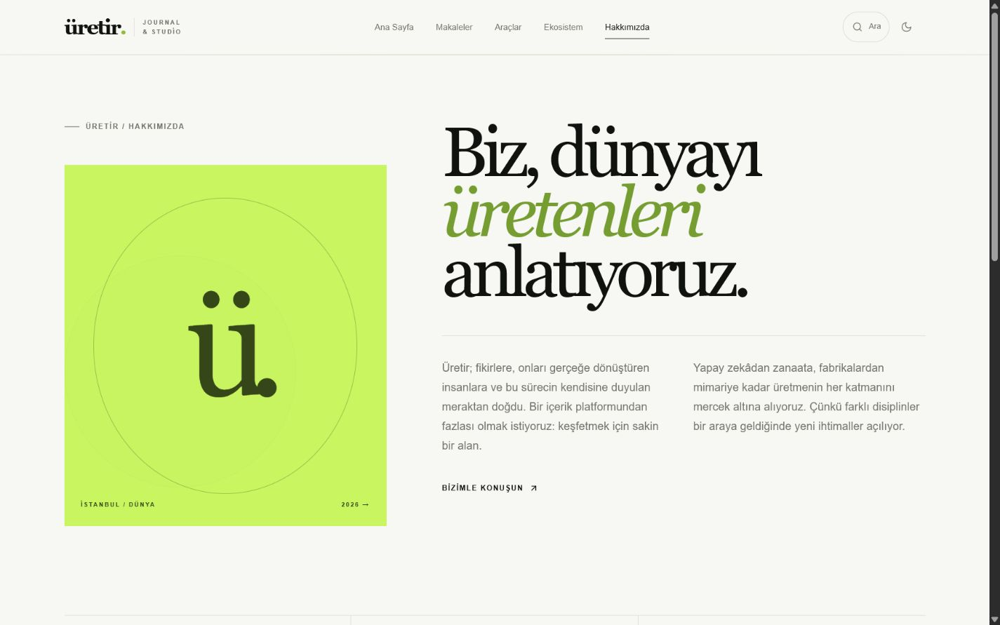 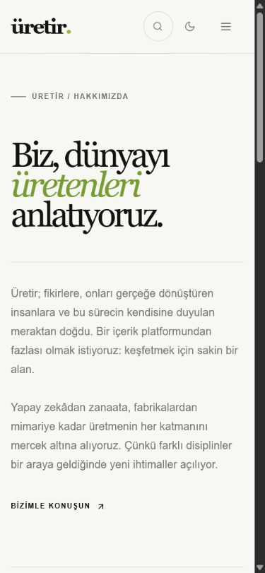

- Purpose: communicate mission, audience, and editorial philosophy.
- Main components: editorial hero, visual mark, mission/principle sections, ecosystem CTA.
- Existing functionality: strong brand narrative aligned with the repository vision.
- Missing functionality: named editorial leadership, expertise, governance, corrections policy, and public evidence of authority.
- UX observations: polished and coherent; stronger real-world trust signals would make the story more credible.
- SEO observations: indexable canonical page in sitemap; supports E-E-A-T only weakly without named accountable people.
- Accessibility observations: one H1/main, decorative treatment uses CSS, no missing alt or overflow.
- Performance/technical observations: static 106 kB page.

### 9. IhracatAI — `/ihracat-ai`

 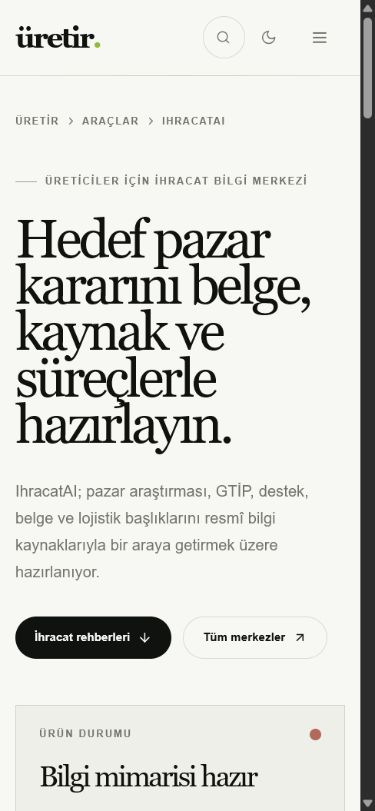

- Purpose: frame export-market, documentation, support, and logistics research.
- Main components: hub hero, readiness workflow, official-source concepts, FAQ, guide area.
- Existing functionality: provides a trustworthy research path and links to related product foundations.
- Missing functionality: GTIP lookup, market comparison, duties/taxes, document workflow, shipping data, and source-grounded assistant.
- UX observations: clear process orientation; users cannot yet finish an export decision.
- SEO observations: noindex until a durable reviewed content cluster exists.
- Accessibility observations: one H1/main, disclosure controls and links are keyboard-native, no overflow.
- Performance/technical observations: static 106 kB foundation; no trade-data adapter.

### 10. İletişim — `/iletisim`

 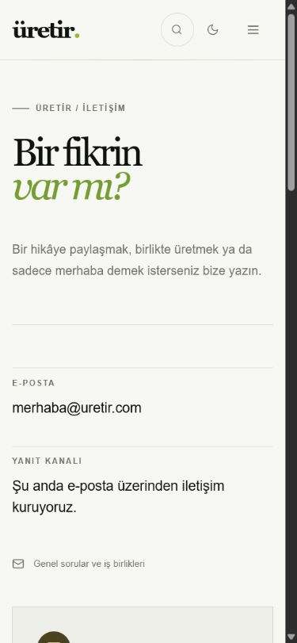

- Purpose: provide a transparent contact channel.
- Main components: contact hero, explanation, `mailto:` action, contact details.
- Existing functionality: opens the user’s email client without pretending to submit or store a web form.
- Missing functionality: support routing, ticketing, service expectations, abuse/reporting path, and server-side delivery.
- UX observations: honest and low-risk; dependence on a local mail client adds friction.
- SEO observations: indexable canonical page in sitemap.
- Accessibility observations: native link action, one H1/main, clear focus and no overflow.
- Performance/technical observations: static 103 kB page; no personal data backend.

### 11. İnsanAI — `/insan-ai`

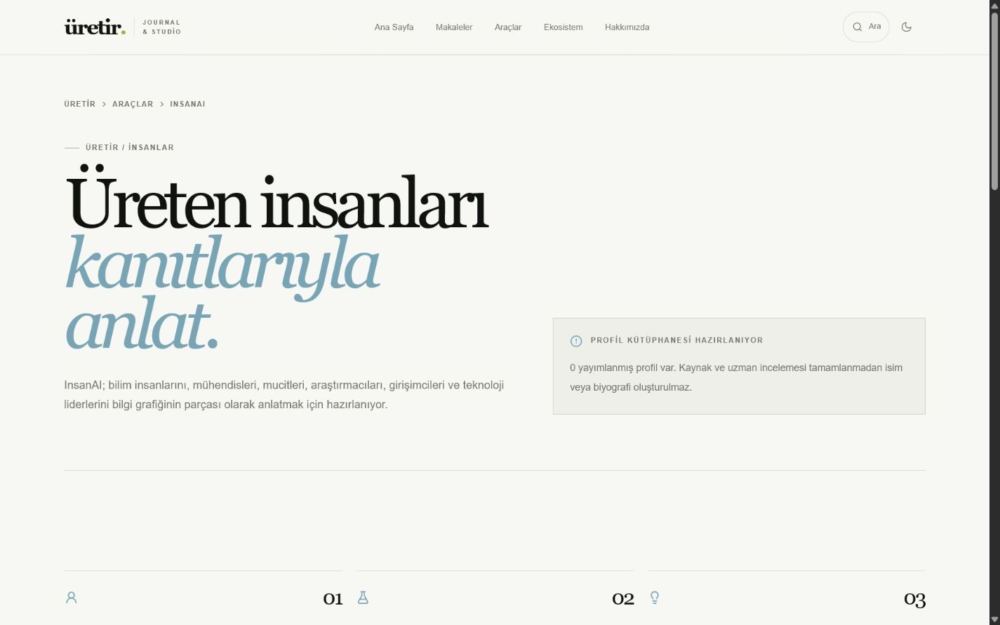 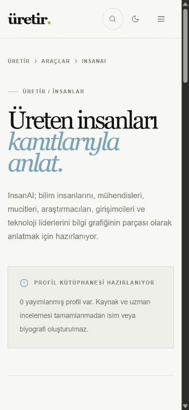

- Purpose: describe a source-reviewed knowledge product for influential people in production and technology.
- Main components: product hero, evidence requirements, empty/foundation state, related routes.
- Existing functionality: strict profile publication contract exists in code; no profiles are present.
- Missing functionality: profiles, source ingestion, editorial review UI, person search, and contribution/correction workflow.
- UX observations: trust-first positioning is strong, but the page offers no usable person discovery.
- SEO observations: noindex; Person schema is emitted only for publishable profiles, of which there are none.
- Accessibility observations: one H1/main, semantic links, no overflow.
- Performance/technical observations: static 106 kB route; `insanAIProfiles` is empty.

### 12. Ne Üretir? şirket dizini — `/ne-uretir`

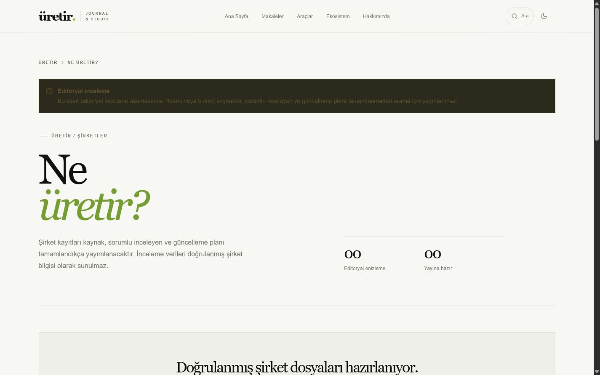 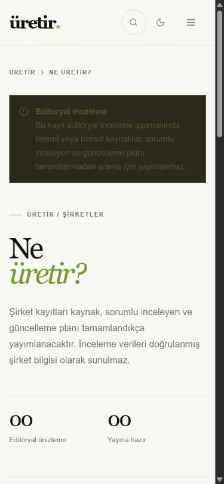

- Purpose: discover verified relationships between companies, products, facilities, industries, and standards.
- Main components: directory hero, counts, production empty state, contribution CTA.
- Existing functionality: prevents five unreviewed company records from appearing as verified public information.
- Missing functionality: any production-visible company, filters, maps, comparison, claim-level sources, and correction workflow.
- UX observations: honest but empty; users arriving with “who produces?” intent cannot complete the task.
- SEO observations: noindex and absent from sitemap because zero company records pass authority review.
- Accessibility observations: one H1/main, clear empty-state message, no overflow.
- Performance/technical observations: static 106 kB page backed by typed file records and a publication gate.

### 13. PuanAI — `/puan-ai`

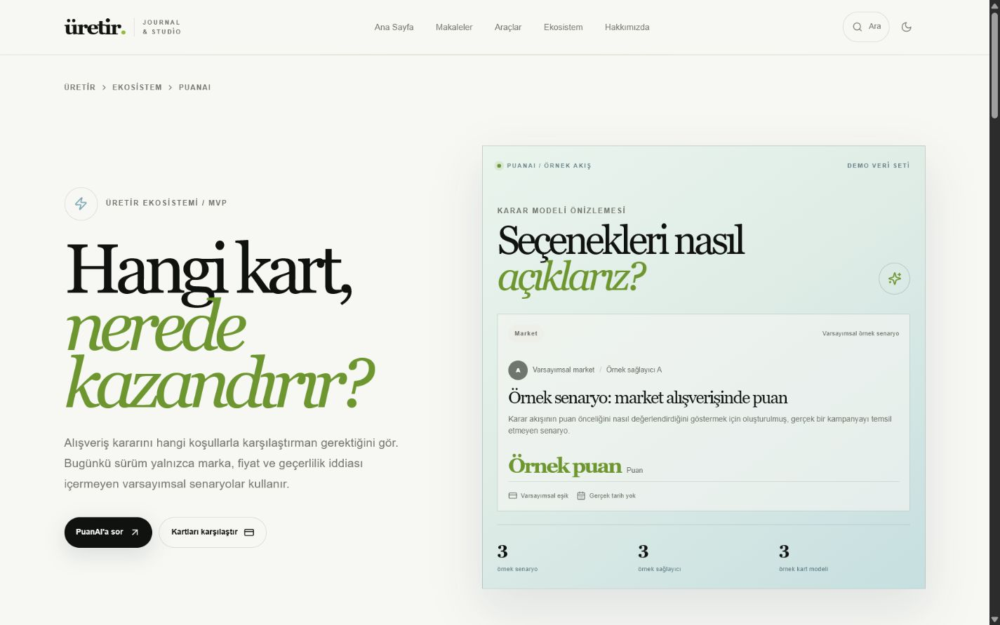 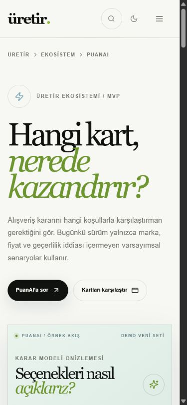

- Purpose: demonstrate an explainable shopping/card decision assistant without making unverified campaign claims.
- Main components: hero, advisor conversation, sample campaign browser, filters, trust labels, educational links, FAQ.
- Existing functionality: interactive intent/prioritization flow, filters, three hypothetical campaigns, explainable recommendation states, explicit sample-data disclosure.
- Missing functionality: live verified campaigns, real cards/banks, personalization, source timestamps, calculations, account persistence, alerts, and an actual model/service.
- UX observations: the most product-like AI surface and a convincing prototype; “AI” is a deterministic client flow and usefulness ends where current data should begin.
- SEO observations: indexable canonical hub, while sample campaign details are noindex; schema avoids representing samples as live offers.
- Accessibility observations: labelled inputs/buttons, one H1/main, responsive layout, no overflow.
- Performance/technical observations: largest route at 113 kB first load; client-side state only, with fail-safe provenance contracts in `lib/puan-ai.ts`.

### 14. Startup Vizyonu — `/startup`

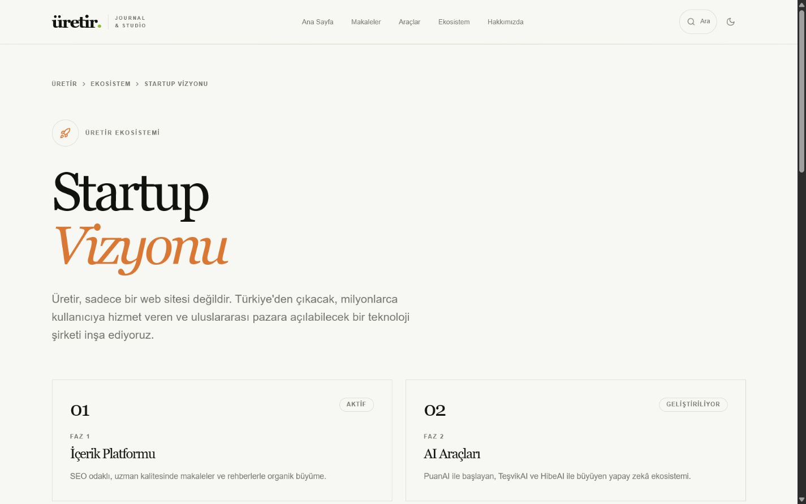 

- Purpose: present the long-term startup/product vision.
- Main components: manifesto hero, strategic sections, ecosystem links.
- Existing functionality: communicates ambition and operating principles.
- Missing functionality: release milestones, evidence, ownership, and a concrete user task.
- UX observations: useful for internal/founder context but not a primary public user destination.
- SEO observations: correctly noindex to avoid competing with user-intent pages.
- Accessibility observations: one H1/main and responsive typography without overflow.
- Performance/technical observations: static 106 kB route.

### 15. TeşvikAI — `/tesvik-ai`

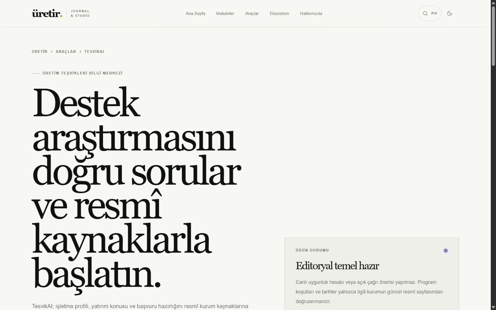 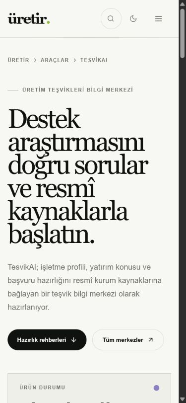

- Purpose: guide production-support research through eligibility questions and official sources.
- Main components: hub hero, readiness framework, official-source explanation, FAQ, guide area.
- Existing functionality: code includes a fail-closed assessment contract that never claims final eligibility and rejects stale/unverified programme records.
- Missing functionality: verified programme registry, ingestion, current deadlines/amounts, profile questionnaire, result matching, alerts, and application workspace.
- UX observations: highly trustworthy framing; it does not yet answer “Which support applies to me?”
- SEO observations: noindex foundation; no incentive page is published.
- Accessibility observations: one H1/main, clear states and disclosures, no overflow.
- Performance/technical observations: static 106 kB route; official sources are registered but not ingested as programme data.

### 16. Trend Merkezi — `/trendler`

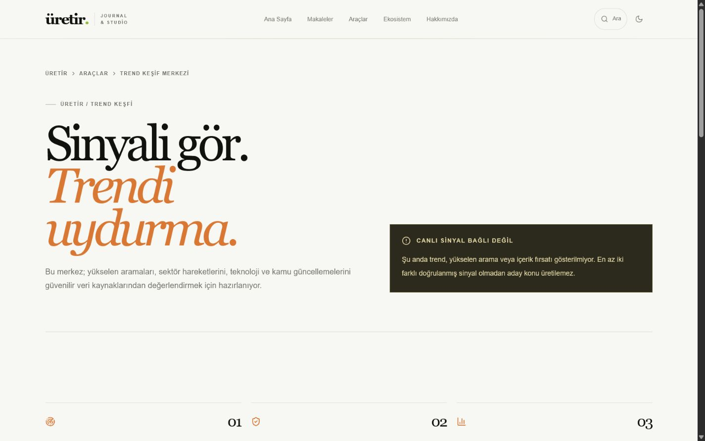 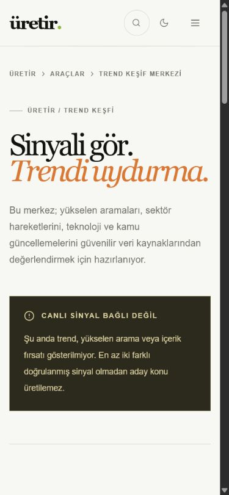

- Purpose: show how search and official signals could become reviewed editorial opportunities.
- Main components: methodology hero, disconnected source cards, evidence gate, workflow.
- Existing functionality: typed source, batch, checkpoint, and multi-source validation contracts.
- Missing functionality: every connector, Search Console access, signal storage, editorial queue, trend visualization, and alerts.
- UX observations: clear “do not invent trends” stance; currently an architecture explainer, not a trend product.
- SEO observations: noindex and correctly excluded from public discovery.
- Accessibility observations: one H1/main, semantic status cards, no overflow.
- Performance/technical observations: static 106 kB route; all four trend sources are `not_connected`.

### 17. UretirAI — `/uretir-ai`

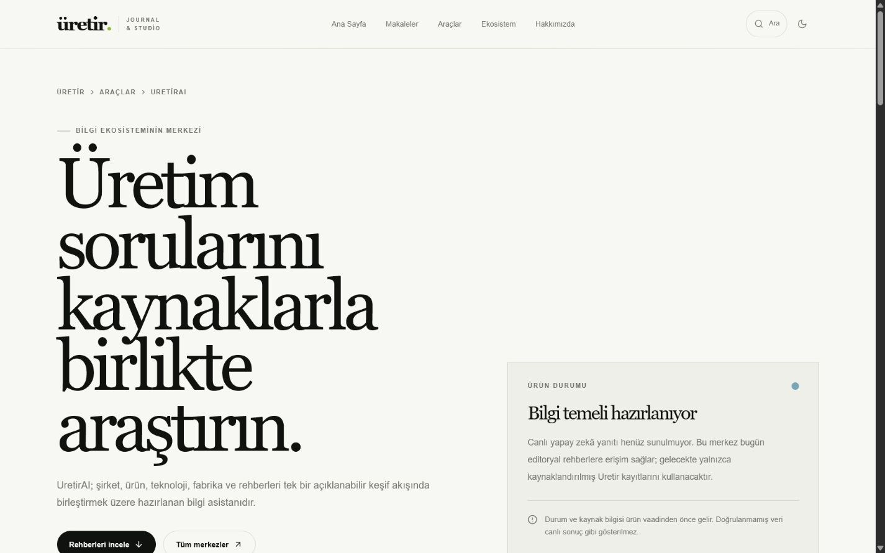 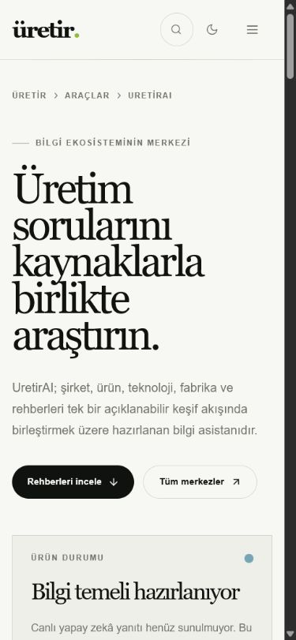

- Purpose: position source-grounded manufacturing research as the heart of the ecosystem.
- Main components: five-pillar hero, capability cards, workflow, graph coverage, guide area, FAQ.
- Existing functionality: exposes knowledge-graph methodology and safe discovery paths.
- Missing functionality: prompt interface, retrieval service, model provider, answer generation, claim citations, evaluation, conversations, and user history.
- UX observations: communicates the right assistant behavior but does not let a user ask a question.
- SEO observations: noindex until source-grounded usefulness and public corpus exist.
- Accessibility observations: one H1/main, semantic sections and no overflow.
- Performance/technical observations: static 106 kB route; AI capability registry is planning/contract code, not an inference runtime.

### 18. Uretir ID — `/uretir-id`

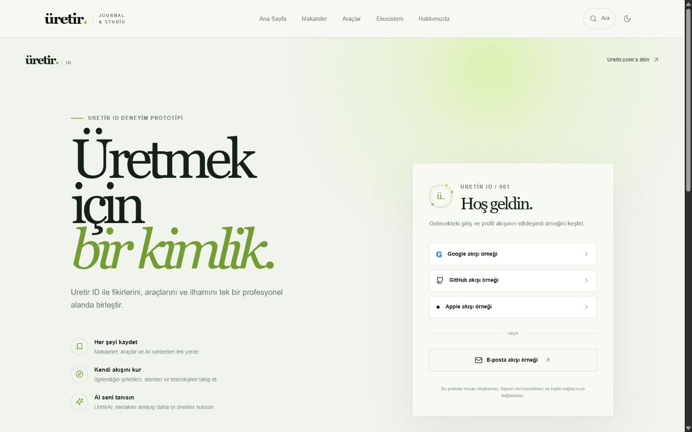 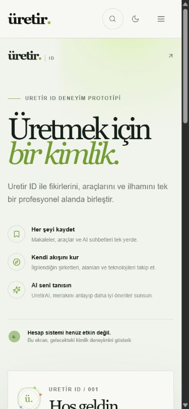

- Purpose: interaction prototype for future identity, onboarding, profile, bookmarks, and workspace.
- Main components: mock sign-in, onboarding steps, client dashboard shell.
- Existing functionality: local client transitions demonstrate a possible experience and explicitly state that no account or personal data is created.
- Missing functionality: authentication, sessions, database, authorization, recovery, consent, export/delete, notifications, and moderation.
- UX observations: polished enough to imply a working account system, making the disclosure essential; production navigation intentionally does not promote it.
- SEO observations: noindex and disallowed in robots.
- Accessibility observations: labelled form controls and one H1/main; a full keyboard/state audit is still required before real auth.
- Performance/technical observations: 109 kB first load, client-only ephemeral state, no persistence.

### 19. Yakında — `/yakinda`

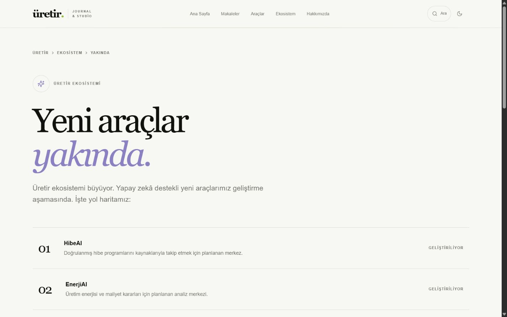 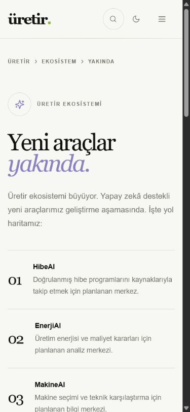

- Purpose: generic destination for unfinished products.
- Main components: coming-soon hero and links back into the ecosystem.
- Existing functionality: prevents dead-end navigation and avoids false availability claims.
- Missing functionality: product-specific value or subscription/notification option.
- UX observations: honest but low value; should remain secondary.
- SEO observations: correctly noindex.
- Accessibility observations: one H1/main, native links, no overflow.
- Performance/technical observations: static 106 kB route.

### 20. 404 — unknown route

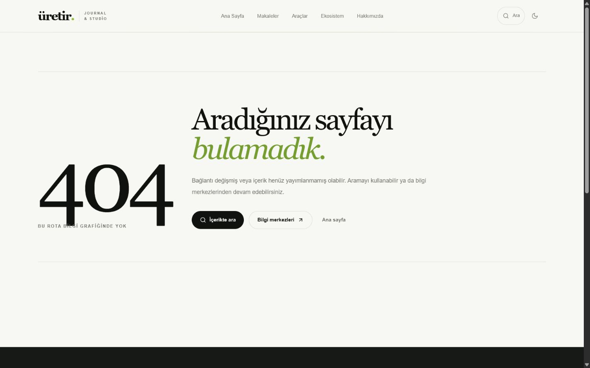 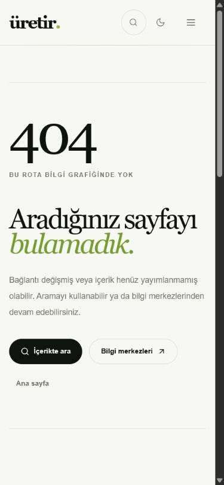

- Purpose: recover users from invalid or unpublished URLs.
- Main components: error code/message, search and tool-directory actions, global navigation.
- Existing functionality: returns HTTP 404 and provides recovery paths.
- Missing functionality: context-aware suggestions or typo correction.
- UX observations: clear, branded, and useful.
- SEO observations: correct status and metadata isolation; unpublished dynamic records also hard-404.
- Accessibility observations: one H1/main, descriptive links, no overflow.
- Performance/technical observations: static not-found shell. Next.js may log an internal `NoFallbackError` for expected hard 404s; documentation calls this out for alert filtering.

### 21. PuanAI sample campaign: market — `/puan-ai/kampanya/ornek-market-puan-senaryosu`

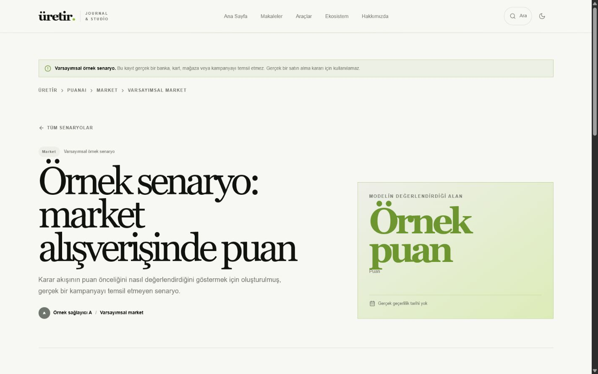 

- Purpose: demonstrate how a future verified market reward campaign would be explained.
- Main components: sample/trust banner, benefit summary, scenario terms, related PuanAI paths.
- Existing functionality: generic provider/card names, no real amount/date, explicit hypothetical disclosure.
- Missing functionality: verified bank source, retrieval/review time, validity, eligibility, actual benefit and calculation.
- UX observations: transparent and reassuring; not actionable for a purchase.
- SEO observations: noindex sample page with canonical route and no live-offer implication.
- Accessibility observations: one H1/main, semantic list and links, no overflow.
- Performance/technical observations: SSG route at 106 kB; provenance defaults to `sample`.

### 22. PuanAI sample campaign: e-commerce — `/puan-ai/kampanya/ornek-e-ticaret-indirim-senaryosu`

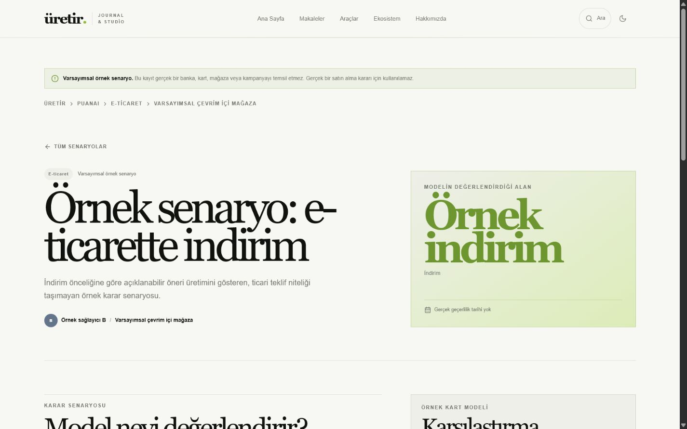 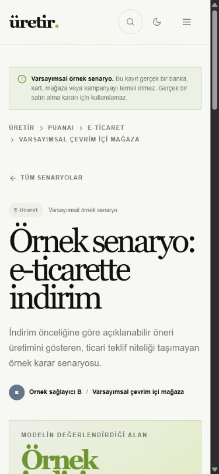

- Purpose: demonstrate explainable discount-priority output.
- Main components: sample/trust banner, hypothetical merchant/card, terms, related links.
- Existing functionality: clearly non-commercial sample with no invented live claim.
- Missing functionality: verified provider data, price baseline, campaign conditions, expiry and suitability.
- UX observations: safe demonstration but no decision value without live evidence.
- SEO observations: correctly noindex and excluded from sitemap.
- Accessibility observations: one H1/main, no overflow or missing alt.
- Performance/technical observations: statically generated from typed sample data.

### 23. PuanAI sample campaign: technology — `/puan-ai/kampanya/ornek-teknoloji-taksit-senaryosu`

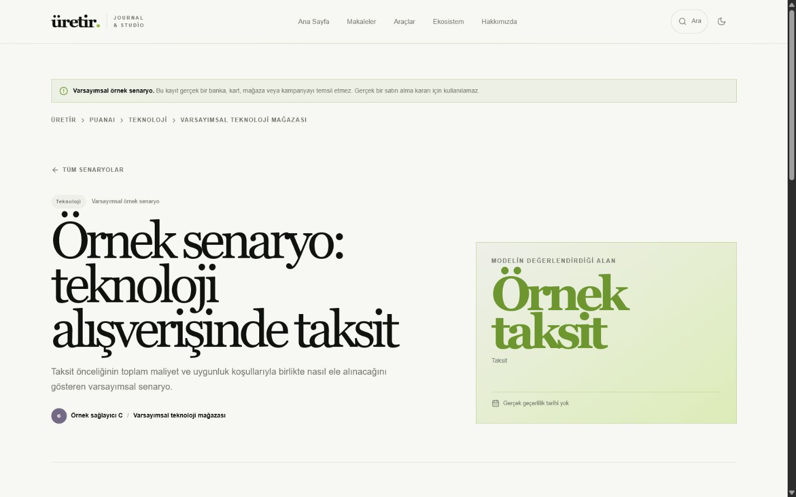 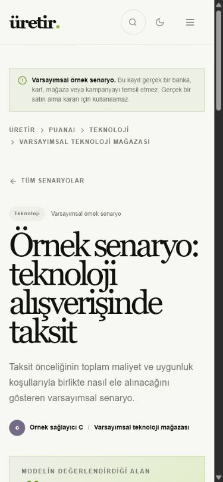

- Purpose: demonstrate how installment priority would be considered with total cost and eligibility.
- Main components: sample/trust banner, hypothetical benefit, terms and related paths.
- Existing functionality: explicitly omits real installment count and cost to avoid fabrication.
- Missing functionality: legal/provider conditions, verified term count, cost calculation, expiry and card eligibility.
- UX observations: excellent safety discipline, but intentionally cannot answer the user’s real question.
- SEO observations: noindex sample route.
- Accessibility observations: one H1/main, semantic content and no overflow.
- Performance/technical observations: static 106 kB route sharing the PuanAI provenance model.

## Editorial-preview-only screens

These 29 screens exist in the codebase and render in local development. In production their parameters are not generated and the routes return hard 404s. This is intentional: every record is `in_review`, no record passes the content-authority gate, all previews use `noindex, follow`, and rich article/company/FAQ schemas are suppressed until approval.

### Article family: shared assessment

- Main components: preview notice, authority-readiness notice, breadcrumbs, editorial hero, reading metadata, article body, source/FAQ/related sections, author block, footer.
- Existing functionality: complete visual editorial template, table-of-contents-ready anatomy, reading time, update date, related discovery, review-state transparency.
- Missing functionality: attributable official/primary sources, named subject/source reviewers, complete intent coverage, balanced examples/limitations, change log, next-review ownership, and publication approval.
- UX observations: the editorial presentation is excellent, but two large review warnings consume most of the first viewport. That is appropriate for internal review, not a publishable reading experience.
- SEO observations: canonical metadata exists, but all pages are noindex, absent from sitemap/RSS/search, and emit only global Organization/WebSite schema.
- Accessibility observations: each capture has one H1/main, semantic headings, no overflow, and no missing image alt. Dark-mode contrast should receive automated verification.
- Performance observations: SSG template, 107 kB first load, no article image payload.
- Technical observations: file records adapt into `ContentDocument`; production exposure requires status, complete publishing authority, and zero blocking authority issues.

### 24. Yapay zekâ ile fikri prototipe dönüştürmek

Route: `/blog/yapay-zeka-ile-fikri-prototipe-donusturmek`

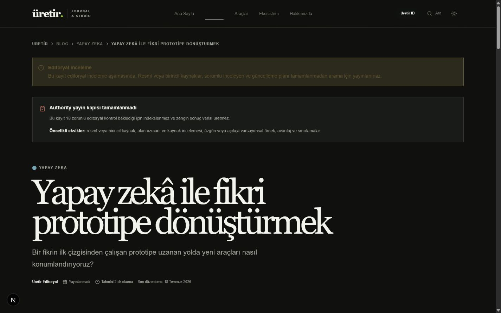 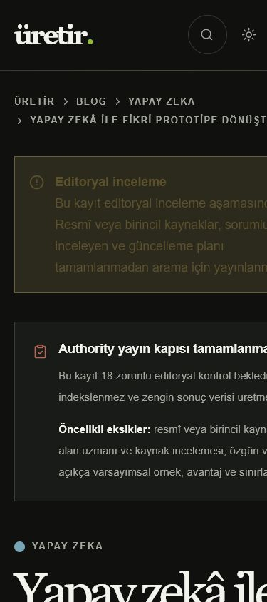

- Purpose: explain how AI can support the path from idea to prototype.
- Existing content/components: question-led article, method sections, FAQ, related paths, review and authority notices.
- Missing page-specific value: expert examples, evidence for tool/process claims, measurable trade-offs, and primary references.

### 25. Geleceğin fabrikası: Veriyle nefes alan sistemler

Route: `/blog/gelecegin-fabrikasi-veriyle-nefes-alan-sistemler`

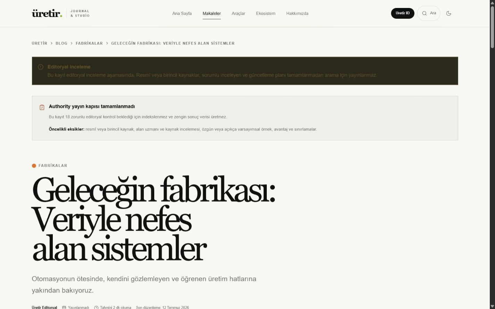 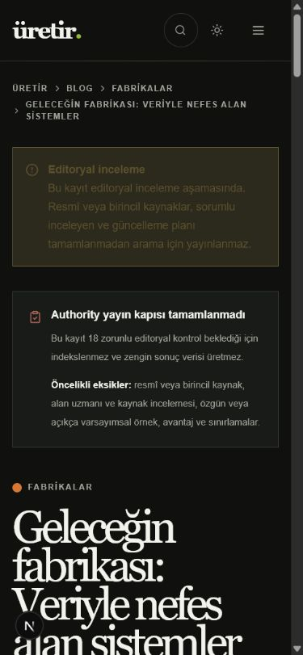

- Purpose: introduce data-driven factory systems.
- Existing content/components: editorial narrative, structured sections, FAQ and related reading.
- Missing page-specific value: real factory cases, architecture detail, operational metrics, limitations, and attributable sources.

### 26. İyi tasarım ile iyi mühendislik arasında

Route: `/blog/iyi-tasarim-ve-iyi-muhendislik-arasinda`

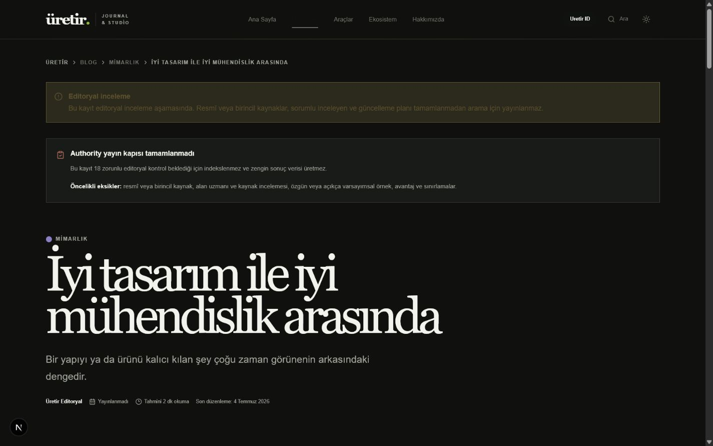 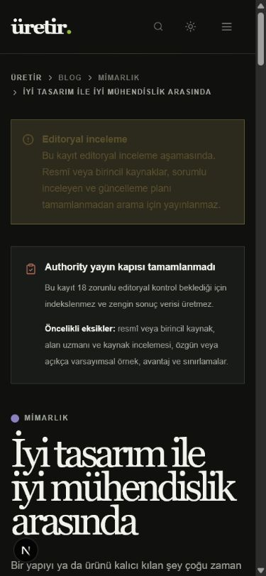

- Purpose: explore the relationship between product design and engineering.
- Existing content/components: long-form editorial template, FAQ and discovery links.
- Missing page-specific value: concrete product cases, decision frameworks, failure modes, expert review and source evidence.

### 27. 3D yazıcıyla üretimde yeni başlangıçlar

Route: `/blog/3d-yaziciyla-uretimde-yeni-baslangiclar`

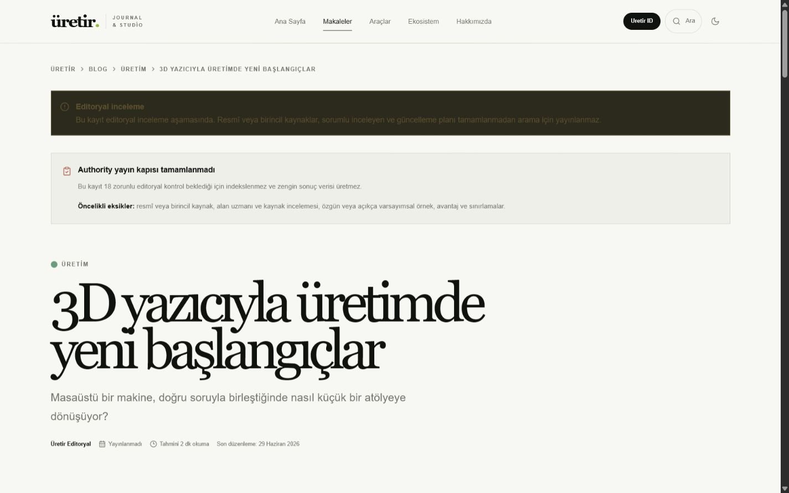 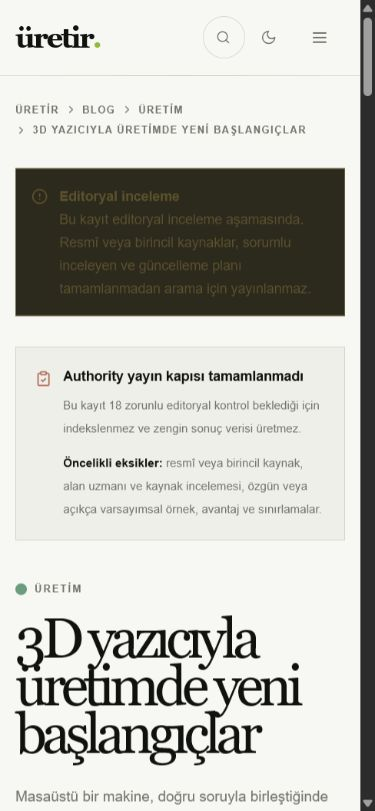

- Purpose: explain entry points into additive manufacturing.
- Existing content/components: accessible introductory article anatomy and related paths.
- Missing page-specific value: process/material comparison, tolerances, costs, safety, machine examples and standards sources.

### 28. Daha çok değil, daha anlamlı üretmek

Route: `/blog/uretkenlik-icin-sistem-kurmak`

 

- Purpose: frame productivity as a system rather than output volume.
- Existing content/components: editorial method sections, FAQ and related discovery.
- Missing page-specific value: original research, practical templates, evidence, disadvantages and accountable expert review.

### 29. Sıfırdan girişim kurarken ilk 90 gün

Route: `/blog/sifirdan-girisim-kurarken-ilk-90-gun`

 

- Purpose: provide an early-stage founder roadmap.
- Existing content/components: staged editorial narrative, FAQ and next-reading paths.
- Missing page-specific value: Turkey-specific legal/financial context, examples, source dates, risk boundaries and expert review.

### Category family: shared assessment

- Main components: breadcrumbs, category hero/art, preview count, article-card grid, archive link and footer.
- Existing functionality: attractive taxonomy browsing and article relationships in local review.
- Missing functionality: any publication-approved member, facets, pagination, topic-cluster depth and entity navigation.
- UX observations: strong visual differentiation; category counts say “İncelemede,” accurately signalling non-production state.
- SEO observations: noindex and hard-404 in production because no approved article belongs to a category.
- Accessibility observations: one H1/main per page, semantic links, no overflow, CSS-only art.
- Performance observations: 106 kB first load with no image payload.
- Technical observations: static parameters are generated only in preview; production parameters depend on approved article membership.

### 30. Yapay Zeka category

Route: `/kategori/yapay-zeka`

 

- Purpose/components/existing: browse the AI editorial cluster and its review article cards.
- Missing page-specific value: published source-grounded AI content and links to verified technologies, people, companies and UretirAI answers.

### 31. Üretim category

Route: `/kategori/uretim`

 

- Purpose/components/existing: browse manufacturing-process editorial records.
- Missing page-specific value: process, machine, material, factory and standard subclusters.

### 32. Teknoloji category

Route: `/kategori/teknoloji`

 

- Purpose/components/existing: browse technology-focused editorial records.
- Missing page-specific value: technology taxonomy, adoption/use-case comparisons and verified entity links.

### 33. Mimarlık category

Route: `/kategori/mimarlik`

 

- Purpose/components/existing: browse architecture, space and material records.
- Missing page-specific value: built examples, material systems, standards and expert-reviewed references.

### 34. Fabrikalar category

Route: `/kategori/fabrikalar`

 

- Purpose/components/existing: browse factory and industrial-site stories.
- Missing page-specific value: verified facility profiles, locations, processes, capacities and source-backed comparisons.

### 35. Girişimcilik category

Route: `/kategori/girisimcilik`

 

- Purpose/components/existing: browse founder and venture-building records.
- Missing page-specific value: Turkish operating context, investment/support entities, practical tools and reviewed case studies.

### Company profile family: shared assessment

- Main components: review/authority notices, company hero, identity and relationship sections, evidence-safe claim presentation, related discovery.
- Existing functionality: five typed company records populate the knowledge graph and local review without entering public recommendations.
- Missing functionality: claim-level official evidence, source/reviewer ownership, corrections, verification badges, comparison, factory drill-down and contribution workflow.
- UX observations: profiles look authoritative, so prominent review warnings and suppression of unsafe claims are essential.
- SEO observations: noindex, no Company-rich schema, absent from sitemap/search, hard 404 in production.
- Accessibility observations: one H1/main, semantic sections, no overflow or image-alt failure.
- Performance observations: 106 kB first load and no remote data.
- Technical observations: company records are file fixtures; publication is fail-closed through the shared authority gate.

### 36. TÜPRAŞ

Route: `/ne-uretir/tupras`

 

- Purpose/components/existing: model a refinery/company entity and its products, facilities and industry relationships.
- Missing page-specific value: current official corporate evidence, facility/production claim provenance and accountable review.

### 37. Kipaş Holding

Route: `/ne-uretir/kipas-holding`

 

- Purpose/components/existing: model a diversified manufacturing-company entity and graph relationships.
- Missing page-specific value: verified business-unit, product, site, capacity and sustainability evidence.

### 38. ASELSAN

Route: `/ne-uretir/aselsan`

 

- Purpose/components/existing: model a defence-technology company and product/technology relationships.
- Missing page-specific value: carefully scoped official claims, dates, export/product boundaries and specialist review.

### 39. Arçelik

Route: `/ne-uretir/arcelik`

 

- Purpose/components/existing: model a consumer-durables manufacturer, brands, products and facilities.
- Missing page-specific value: current brand/site/product evidence, geographic scope and review ownership.

### 40. Ford Otosan

Route: `/ne-uretir/ford-otosan`

 

- Purpose/components/existing: model an automotive manufacturer and vehicle/factory relationships.
- Missing page-specific value: current factory/product/capacity sources, date-scoped claims and expert review.

### Guide family: shared assessment

- Main components: breadcrumbs, review and authority notices, intent/pillar labels, quick answer, six-question framework, steps, risks, official-source links, FAQ and discovery section.
- Existing functionality: strongest reusable editorial architecture in the repository; official-source starting points, dates and internal relationships are modelled.
- Missing functionality: human subject/source reviewers, claim-level evidence completeness, original examples, change logs, next-review accountability and final approval.
- UX observations: clear reference structure, though the two review panels push the quick answer far below the fold, especially on mobile.
- SEO observations: all noindex and production-hard-404; no FAQ/Article rich data until authority approval.
- Accessibility observations: one H1/main, native disclosures and links, no overflow or missing alt.
- Performance observations: 106 kB first load, server-rendered, no third-party scripts.
- Technical observations: all guides adapt into the same `ContentDocument` and authority gate as articles, preventing status-only publication.

### 41. Bir üretim sorusu nasıl güvenilir biçimde araştırılır?

Route: `/rehber/uretim-sorusu-nasil-arastirilir`

 

- Purpose/existing: teach source-first manufacturing research and route users into UretirAI methodology.
- Missing page-specific value: worked research example, evaluation evidence and named editorial review.

### 42. Bir AI cevabındaki kaynaklar nasıl değerlendirilir?

Route: `/rehber/ai-cevabinda-kaynak-nasil-degerlendirilir`

 

- Purpose/existing: teach source, freshness, scope and uncertainty checks for AI answers.
- Missing page-specific value: annotated answer examples, model-risk cases and expert review.

### 43. Online alışverişte kart seçimi nasıl yapılır?

Route: `/rehber/online-alisveriste-kart-secimi`

 

- Purpose/existing: explain card selection by total decision context rather than reward headline.
- Missing page-specific value: verified current regulations/provider references, calculations and real examples.

### 44. Taksit ve toplam maliyet nasıl karşılaştırılır?

Route: `/rehber/taksit-ve-toplam-maliyet-rehberi`

 

- Purpose/existing: teach installment and total-cost comparison.
- Missing page-specific value: calculator, current regulatory boundaries, assumptions and reviewed examples.

### 45. Bir kart kampanyası nasıl doğrulanır?

Route: `/rehber/kampanya-bilgisi-nasil-dogrulanir`

 

- Purpose/existing: teach official-channel, date, eligibility and condition verification.
- Missing page-specific value: live provider/source examples and an operated verification workflow.

### 46. Teşvik başvurusuna nasıl hazırlanılır?

Route: `/rehber/tesvik-basvurusuna-hazirlik`

 

- Purpose/existing: organize applicant, project, budget and document readiness.
- Missing page-specific value: programme-specific branches, official current requirements and reviewed templates.

### 47. Teşvik uygunluğu nasıl ön değerlendirilir?

Route: `/rehber/tesvik-uygunluk-kontrol-listesi`

 

- Purpose/existing: teach a non-binding, evidence-aware eligibility precheck.
- Missing page-specific value: verified programme rules, interactive profile input and current source snapshots.

### 48. Teşvik başvuru belgeleri nasıl yönetilir?

Route: `/rehber/tesvik-basvurusu-gerekli-belgeler`

 

- Purpose/existing: structure document requirements and version/freshness checks.
- Missing page-specific value: programme-specific document registry, upload/workspace and official current checklists.

### 49. Hammadde fiyatı nasıl karşılaştırılır?

Route: `/rehber/hammadde-fiyati-nasil-karsilastirilir`

 

- Purpose/existing: normalize unit, quality, currency, logistics and time when comparing prices.
- Missing page-specific value: live datasets, audited unit/FX normalization and worked procurement examples.

### 50. Bir fiyat serisi nasıl doğru okunur?

Route: `/rehber/fiyat-serisi-nasil-okunur`

 

- Purpose/existing: explain trend, seasonality, revisions and comparability.
- Missing page-specific value: sourced series, interactive chart, statistical examples and reviewer sign-off.

### 51. İhracata hazırlık kontrol listesi nasıl oluşturulur?

Route: `/rehber/ihracata-hazirlik-kontrol-listesi`

 

- Purpose/existing: organize product, capacity, compliance, pricing and operational readiness.
- Missing page-specific value: product/market branches, downloadable workspace, official requirements and expert review.

### 52. İhracat destekleri hangi resmî kaynaklardan izlenir?

Route: `/rehber/ihracat-destekleri-resmi-kaynaklar`

 

- Purpose/existing: teach how to follow export support scope and changes at authoritative sources.
- Missing page-specific value: verified programme registry, change monitoring, source snapshots and reviewed current examples.

## Screens and routes not present

- No admin route.
- No CMS/editor UI route.
- No authentication callback/API route.
- No user profile, collection, bookmark, comment, notification, company-claim, or moderation route.
- No API routes at all.
- No terms-of-service, cookie-policy, accessibility-statement, corrections-policy, or editorial-team page.
- Editorial administration currently happens through repository files, review contracts, reports and documentation.

## Current architecture

```text
Next.js App Router presentation
  ├─ Server-rendered/static routes
  ├─ Narrow client islands (theme, search filters, PuanAI, Uretir ID)
  └─ Route metadata and JSON-LD
          ↓
Typed file-backed domain modules
  ├─ Content/editorial/publication contracts
  ├─ Search projection and internal discovery
  ├─ Knowledge graph and entity relations
  ├─ AI product/capability registries
  └─ Official-source registry and product safety models
          ↓
No operated adapters yet
  ├─ No database or CMS
  ├─ No auth/community service
  ├─ No live search index
  ├─ No AI/model/retrieval service
  ├─ No source-ingestion jobs
  └─ No analytics/observability provider
```

### Folder structure

```text
app/          Routes, route metadata, layouts, error/loading/404, sitemap, robots, RSS
components/   27 reusable visual and interactive components
lib/          34 domain, editorial, SEO, graph, search and AI modules
docs/         34 product/engineering operating-system documents
scripts/      Report generation and production-output validation
reports/      Content-gap, ecosystem and this release-candidate review
public/       Static assets
.github/      Main/pull-request quality workflow
```

The reviewed TypeScript/TSX/MJS application surface contains 98 files and approximately 7,239 lines.

### Technology stack

- Next.js 15.5.21 App Router.
- React and React DOM 19.2.7.
- TypeScript 5.9.3 with production type checking.
- Tailwind CSS 3.4.19 plus a substantial custom CSS design layer.
- Lucide React 0.468.0.
- Sharp 0.35.3.
- pnpm 11.15.1 and Node 22 in CI.
- ESLint 9.39.5; `eslint-config-next` currently resolves to 15.5.20, one patch behind Next.
- GitHub Actions quality workflow on pull requests and pushes to `main`.

## Product subsystems

### Existing AI modules

The registry models 17 AI products and 25 cross-product capabilities. Public/foundation routes exist for UretirAI, PuanAI, TeşvikAI, FiyatAI, IhracatAI, İnsanAI and TrendAI. Additional products—including FactoryAI, MachineAI, StandardsAI, EnergyAI, AgricultureAI, InvestmentAI, SupplyChainAI, ComplianceAI and DocumentAI—are candidate architecture only and expose no route.

Implemented code is mostly contracts: citation rendering, freshness enforcement, uncertainty labels, publication-aware search, eligibility precheck, and human-escalation semantics. There is no model provider, prompt orchestration, vector/keyword retrieval backend, conversation store, evaluation dataset, or answer API. PuanAI is deterministic client logic over three hypothetical sample records. TeşvikAI has a good fail-closed assessment model but no verified programme records.

### SEO and metadata

- Metadata base, title templates, route descriptions, canonicals, robots directives, Open Graph and Twitter cards are implemented.
- Five legacy URL redirects are permanent.
- Organization and WebSite JSON-LD are global.
- Article, FAQ, BreadcrumbList, CollectionPage and company/entity schemas exist behind publication gates.
- Draft/review pages do not emit rich-result schemas.
- One generic site-level Open Graph image is used; there are no article/entity-specific verified visuals.
- Production validation checks titles, descriptions, canonicals, structured data, noindex behavior, internal routes and anchors.

### Sitemap, robots and RSS

- Sitemap is dynamic and publication-aware but currently exposes only 7 URLs: homepage, tools, ecosystem, PuanAI, about, contact and privacy.
- Robots allows general crawling, disallows `/api/` and `/uretir-id`, and points to the sitemap.
- RSS is implemented and publication-aware but intentionally contains 0 items.
- The hard-coded 25 July 2026 sitemap modification date should eventually come from release/content state rather than source code.

### Analytics

Twelve typed interaction events are instrumented through data attributes and a browser bridge. The bridge emits only local `CustomEvent`s. It reads no form value, stores nothing, sets no cookie and makes no network request. This is a safe integration seam, not analytics. There is no traffic, funnel, retention, Core Web Vitals, search-query or AI-usefulness measurement in production.

### Internal linking and discovery

Header/footer navigation, hub cards, guide relationships, `ContentDiscoverySection`, search projection and graph recommendations are reusable. Review-only entities are excluded by default. The technical system is stronger than the current user outcome: because zero reference documents are public, most production linking is between product foundations rather than within authoritative topic clusters.

### Knowledge graph

- 156 typed entities.
- 220 typed relationships.
- No orphan entities under repository validation.
- 23 content documents reviewed; 0 authority-ready.
- 50 official-source registry entries.
- Entities cover articles, guides, companies, products, factories, industries, technologies, machines, raw materials, standards, institutions, investment programmes, people and AI products.

The graph is in-memory/file-backed and useful for modelling, validation, recommendations and gap reporting. It is not a persistent graph service, does not ingest source changes, and does not yet expose verified public breadth.

### Performance

- Shared first-load JavaScript: 102 kB.
- Typical route: 106 kB.
- Homepage: 109 kB.
- Blog: 110 kB.
- PuanAI: 113 kB.
- Uretir ID: 109 kB.
- Predominantly static generation and Server Components.
- No third-party script, remote image library, ad network or analytics SDK.
- Reduced-motion CSS is present.

These are strong architectural indicators, not field performance evidence. There is no Lighthouse CI, bundle budget, real-user Core Web Vitals, synthetic uptime monitor or performance regression dashboard.

### Accessibility

The implementation includes Turkish language metadata, skip navigation, semantic header/main/footer regions, one H1 per reviewed screen, visible focus treatment, reduced motion, labelled navigation/forms, accessible loading/error states, and mobile layouts without detected overflow. The review did not find missing image alt attributes.

Remaining gaps are systematic automated coverage (axe or equivalent), contrast validation in both themes, screen-reader flows for interactive PuanAI/Uretir ID states, keyboard regression tests, and an accessibility statement/feedback channel.

### Security

Positive controls include HSTS, MIME-sniffing protection, same-origin framing, opener/resource isolation, restrictive referrer and browser-permission policies, disabled `X-Powered-By`, safe JSON-LD escaping, publication fail-closed behavior, no active personal-data backend, and a clean production dependency audit.

Material gaps: no Content Security Policy, no operated secret/config registry, no SAST/secret scanning documented in CI, no dependency-update automation, no incident response tooling, and no production auth/data layer to assess. CSP becomes mandatory before adding authentication, third-party scripts or payment-adjacent integrations.

## Comparison with the original vision

### Already completed

- Professional documentation operating system and decision records.
- Distinctive, responsive design system with light/dark modes.
- Five-pillar and topic-cluster modelling.
- Reusable editorial content model and guide/article/company adapters.
- Fail-closed publication authority gate.
- Metadata, canonical, noindex, sitemap, robots, RSS and schema foundations.
- Typed knowledge graph and official-source registry.
- Publication-aware search and discovery.
- Trust-state separation for verified, estimated, sample and future integration.
- PuanAI’s transparent hypothetical-data experience.
- CI quality gate and production dependency audit.

### Partially completed

- Content engine: architecture is strong; zero record is authority-ready.
- Internal linking: reusable system exists; public topical depth is missing.
- AI ecosystem: product/capability contracts exist; no live grounded AI.
- TeşvikAI/FiyatAI/IhracatAI: educational foundations without operational data.
- Community/Uretir ID: polished prototype and docs without identity or persistence.
- Measurement: event contract without provider or insight loop.
- Production operations: CI exists; CD, rollback, monitoring and ownership do not.

### Missing

- One fully reviewed, source-backed public topic cluster.
- CMS/editorial workflow UI and durable revision/source storage.
- Verified source ingestion and freshness/change detection.
- Source-grounded retrieval and AI answer service.
- Production authentication, profiles, bookmarks, collections, following and notifications.
- Operated search infrastructure and query-quality telemetry.
- Consent-aware analytics, Search Console connection and Core Web Vitals monitoring.
- Hosting decision, immutable promotion, rollback rehearsal, uptime/error monitoring and incident owner.
- Public editorial team, corrections process and stronger trust pages.

### Technical debt

- File-backed domain data cannot support concurrent editorial operations at the target scale.
- Validation is broad but does not execute a post-build production server smoke suite; stale processes exposed this blind spot.
- `eslint-config-next` resolves one patch behind Next.
- Large `globals.css` concentrates multiple product design systems in one file.
- Route-level metadata/schema patterns still require careful per-page composition.
- Build-time dates are hard-coded in sitemap/content fixtures.
- There are no component, unit, integration, accessibility or browser-regression test suites beyond the custom output validator.
- The Uretir ID prototype can be reached directly in production even though robots and navigation hide it; a deployment-level feature flag would be safer.

### Highest-priority improvements

1. Publish one complete authority cluster after real subject/source review.
2. Connect privacy-safe analytics, Search Console and Core Web Vitals.
3. Add a post-build `next start` smoke suite for critical 200/404/metadata behavior.
4. Build source ingestion/versioning for the chosen cluster.
5. Add source-grounded UretirAI retrieval over only approved records.
6. Add CMS/storage behind existing domain contracts.
7. Establish hosting, immutable release promotion, rollback, monitoring and incident ownership.
8. Improve public trust with named reviewers, corrections, methods and change history.
9. Add automated accessibility and browser regression coverage.
10. Only after the loop is proven, add persistent Uretir ID/workspace behavior.

## Founder Review scores

| Area | Score | Reason |
| --- | ---: | --- |
| Product | 5.5/10 | Strong proposition and prototypes; few completed user jobs. |
| UI | 8.5/10 | Distinctive, cohesive and premium visual system. |
| UX | 6.5/10 | Clear and trustworthy, but many destinations stop at explanation. |
| Performance | 8.0/10 | Excellent static profile; no RUM or Lighthouse evidence. |
| SEO | 7.0/10 | Strong technical foundation; almost no publishable authority inventory. |
| Authority | 3.5/10 | Rigorous gate, but 0 of 23 reviewed documents pass it. |
| Content System | 8.0/10 | Scalable contracts and review model; no operated editorial workflow. |
| AI Readiness | 4.0/10 | Good trust/capability design; no live grounded AI runtime. |
| Scalability | 6.0/10 | Strong abstractions, file-backed implementation and no service adapters. |
| Maintainability | 8.0/10 | Typed boundaries, reusable components, docs and CI are strong. |
| Production Readiness | 4.5/10 | Buildable and safe, but content, operations, monitoring and live services are not ready. |

## Final founder questions

### 1. If this product were launched today, what would impress users?

The visual identity, editorial restraint, speed, mobile quality, explicit trust labels, and the refusal to fabricate campaigns or incentives would stand out. PuanAI feels like a credible product prototype, and the consistency across the ecosystem suggests serious long-term thinking.

### 2. What would disappoint users?

Users would quickly discover that the public knowledge library is empty, most “AI” destinations are explanatory pages, company discovery has no verified profiles, and no account/workspace behavior persists. The promise is substantially larger than the current usable depth.

### 3. What are the biggest blockers before reaching production quality?

Zero authority-ready content; no live source ingestion or grounded AI; no production analytics/observability; no operated hosting, release and rollback process; no CMS/database; and no accountable editorial/incident ownership. These are launch-system blockers, not visual polish issues.

### 4. What are the ten highest ROI improvements?

1. Complete and publish one expert-reviewed manufacturing topic cluster.
2. Instrument organic entry, continuation, source use, AI use and return behavior.
3. Connect Search Console and route-level Core Web Vitals.
4. Add critical-route production smoke tests to CI.
5. Build official-source ingestion/versioning for that first cluster.
6. Launch source-grounded UretirAI retrieval only over approved content.
7. Add named reviewers, corrections, methods and visible change history.
8. Introduce CMS/storage through the existing content contracts.
9. Establish immutable deployment, monitoring, rollback and incident ownership.
10. Add a minimal persistent research workspace only after the content-to-AI loop proves return value.

### 5. If you were the technical founder, what would you build next and why?

I would build one closed authority loop: validated search demand → five-to-ten source-backed pages around one manufacturing entity/topic → human review → knowledge-graph/internal links → UretirAI retrieval with claim-level citations → privacy-safe measurement of continuation and return. It converts the strongest existing architecture into real traffic, trust and repeat utility, while revealing which infrastructure is genuinely needed before investing in broader community or AI surface area.
